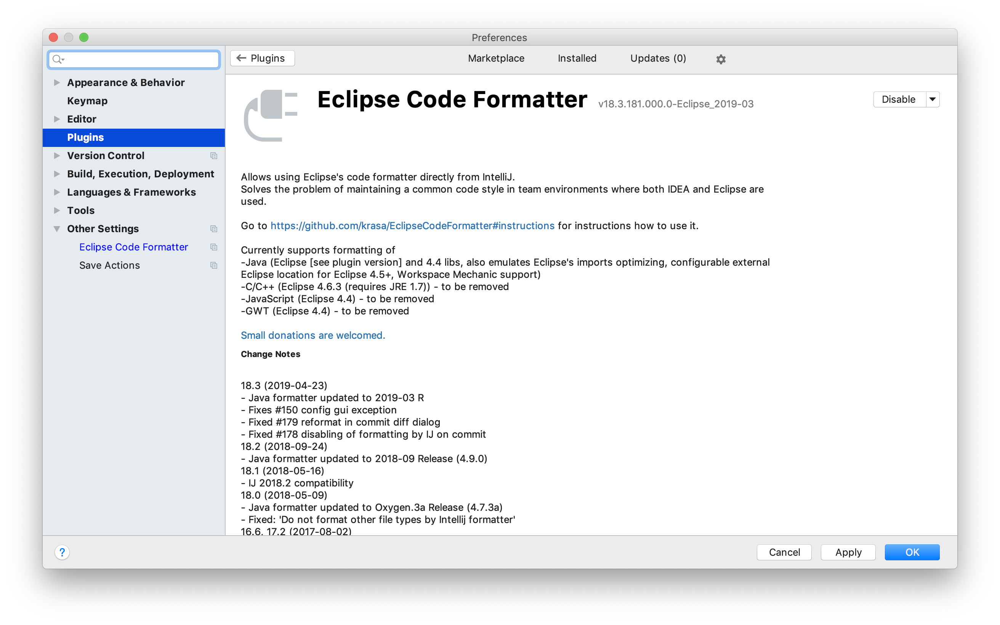
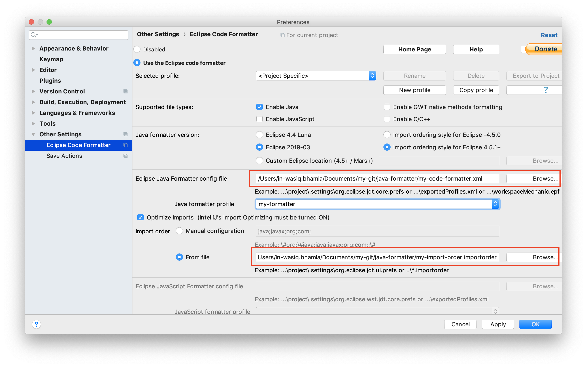

# Java Code Formatter

Ever faced a situation where every member of the team codes as per their convenience and style which causes problems for others to understand their code?

This problem can be countered when all the team member use the same code formatter configured into their IDE. This also helps to maintain a uniform coding style for the whole project thus reducing the rework to lint the code.

# Usage

These code formatting can be configured on Eclipse IDE and IntelliJ IDE as well, so depending which is your favourite IDE, you can easily configure code formatting as shown below.

## Eclipse IDE

Since the code style settings were exported from Eclipse, it is as easy to import it to Eclipse.

### Configure Clean Up code settings

Import the `my-clean-up.xml` file under `Preferences > Java > Code Style > Clean Up`.

### Configure Code formatter settings

Import `my-code-formatter.xml` file under `Preferences > Java > Code Style > Formatter`.

### Configure Organise Import settings

Import `my-import-order.importorder.xml` file under `Preferences > Java > Code Style > Organize Import`.

### Trigger code formatting

To trigger code formatting, navigate to menu `Source > Format`.

## IntelliJ IDE

For importing these setting files in IntelliJ, you need to first install `Eclipse Code Formatter` plugin from `Preferences > Plugins`.

### Configure Code formatting and Organise import settings

Once the plugin is installed and IDE is restarted, navigate to `Preferences > Other Settings > Eclipse Code Formatter` and import `my-code-formatter.xml` in `Eclipse Java Formatter config file` and `my-import-order.importorder` in `Import order > From File`.

### Trigger code formatting

To trigger code formatting, navigate to menu `Code > Reformat Code`.

# Conclusion

This settings will help you maintain a uniform code style throughout the project.

> If you liked the formatting, :star: **the repo** and share the repository among your network.

# Contribution

You can update the config files in Eclipse and **send a PR across**, if it looks good, I will be glad to merge your changes in.
