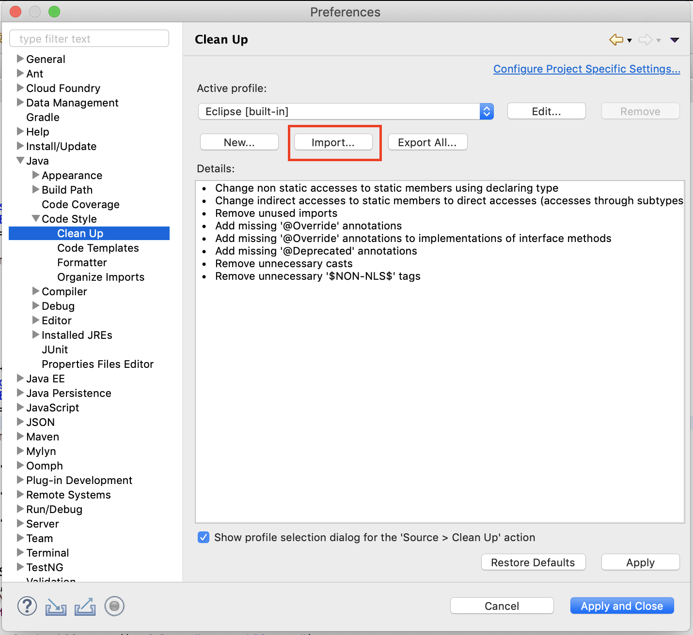
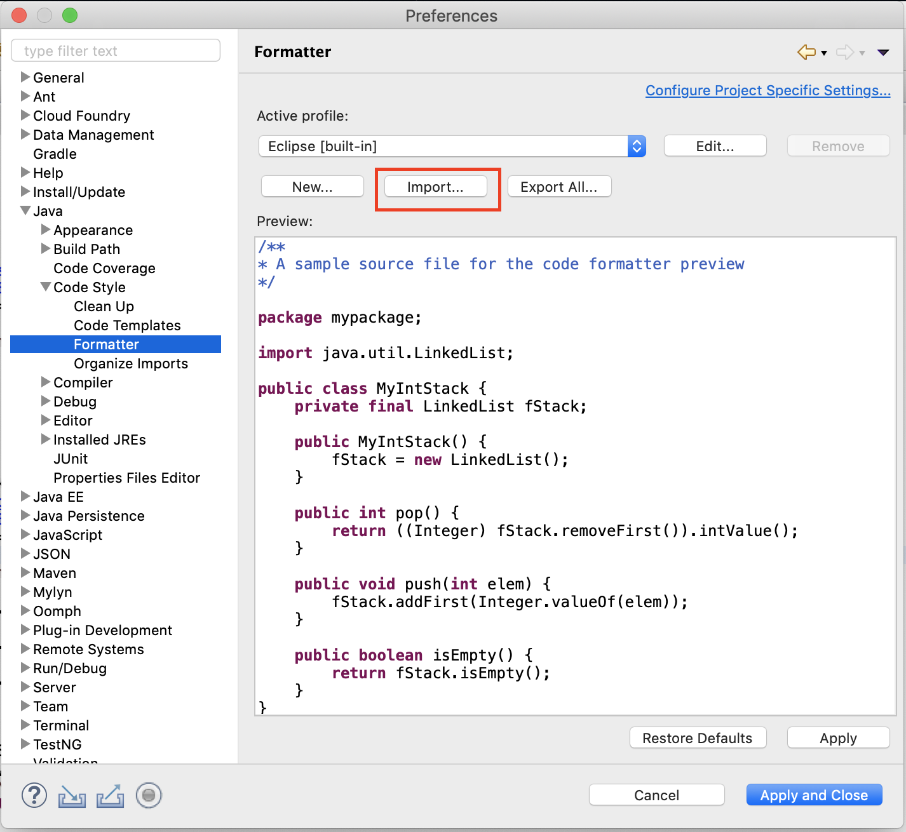
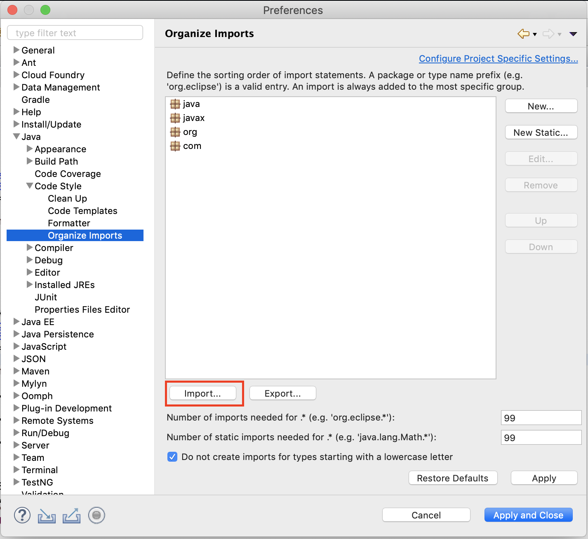

# Java Code Formatter

Ever faced a situation where every member of the team codes as per their convenience which causes problems for others to understand their code?

This problem can be countered when all the team member use the same code formatter configured into their IDE. This also helps to maintain a uniform coding style for the whole project thus reducing the rework to lint the code.

# Usage

## Eclipse IDE

Since the code style settings were exported from Eclipse, it is as easy to import it to Eclipse.

### Clean Up code

Import the `my-clean-up.xml` file under `Preferences > Java > Code Style > Clean Up`.

### Code formatter

Import `my-code-formatter.xml` file under `Preferences > Java > Code Style > Formatter`.

### Organise Import

Import `my-import-order.importorder.xml` file under `Preferences > Java > Code Style > Organize Import`.

